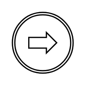
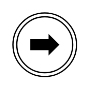
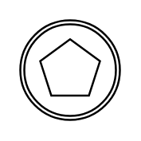
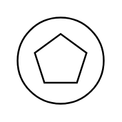
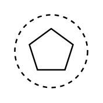
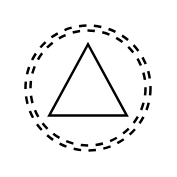
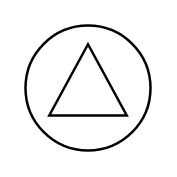
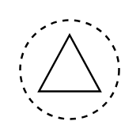
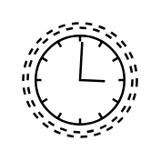
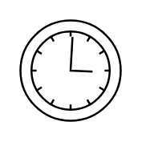

# BPMN 2.0 Events Entities

- [CancelEnd](./cancel-end.md)  

- [CancelIntermediateBoundaryInterrupting](./cancel-intermediate-boundary-interrupting.md)  

- [CompensationEnd](./compensation-end.md)  

- [CompensationIntermediateBoundaryInterrupting](./compensation-intermediate-boundary-interrupting.md)  

- [CompensationIntermediateThrowing](./compensation-intermediate-throwing.md)  

- [CompensationStartInterrupting](./compensation-start-interrupting.md)  

- [ConditionalIntermediateBoundaryInterrupting](./conditional-intermediate-boundary-interrupting.md)  

- [ConditionalIntermediateBoundaryNonInterrupting](./conditional-intermediate-boundary-non-interrupting.md)  

- [ConditionalIntermediateCatching](./conditional-intermediate-catching.md)  

- [ConditionalStartInterrupting](./conditional-start-interrupting.md)  

- [ConditionalStartNonInterrupting](./conditional-start-non-interrupting.md)  

- [End](./end.md)  

- [ErrorEnd](./error-end.md)  

- [ErrorIntermediateBoundaryInterrupting](./error-intermediate-boundary-interrupting.md)  

- [ErrorStartInterrupting](./error-start-interrupting.md)  

- [EscalationEnd](./escalation-end.md)  

- [EscalationIntermediateBoundaryInterrupting](./escalation-intermediate-boundary-interrupting.md)  

- [EscalationIntermediateBoundaryThrowing](./escalation-intermediate-boundary-throwing.md)  

- [EscalationIntermediateNonInterrupting](./escalation-intermediate-non-interrupting.md)  

- [EscalationStartInterrupting](./escalation-start-interrupting.md)  

- [EscalationStartNonInterrupting](./escalation-start-non-interrupting.md)  

- [LinkIntermediateCatching](./link-intermediate-catching.md)  

- [LinkIntermediateThrowing](./link-intermediate-throwing.md)  

- [MessageEnd](./message-end.md)  

- [MessageIntermediateBoundaryInterrupting](./message-intermediate-boundary-interrupting.md)  

- [MessageIntermediateBoundaryNonInterrupting](./message-intermediate-boundary-non-interrupting.md)  

- [MessageIntermediateCatching](./message-intermediate-catching.md)  

- [MessageIntermediateThrowing](./message-intermediate-throwing.md)  

- [MessageStartInterrupting](./message-start-interrupting.md)  

- [MessageStartNonInterrupting](./message-start-non-interrupting.md)  

- [MultipleEnd](./multiple-end.md)  

- [MultipleIntermediateBoundaryInterrupting](./multiple-intermediate-boundary-interrupting.md)  

- [MultipleIntermediateBoundaryNonInterrupting](./multiple-intermediate-boundary-non-interrupting.md)  

- [MultipleIntermediateCatching](./multiple-intermediate-catching.md)  

- [MultipleIntermediateThrowing](./multiple-intermediate-throwing.md)  

- [MultipleStartInterrupting](./multiple-start-interrupting.md)  

- [MultipleStartNonInterrupting](./multiple-start-non-interrupting.md)  

- [NoneIntermediateThrowing](./none-intermediate-throwing.md)  

- [NoneStart](./none-start.md)  

- [ParallelMultipleIntermediateBoundaryInterrupting](./parallel-multiple-intermediate-boundary-interrupting.md)  

- [ParallelMultipleIntermediateBoundaryNonInterrupting](./parallel-multiple-intermediate-boundary-non-interrupting.md)  

- [ParallelMultipleIntermediateCatching](./parallel-multiple-intermediate-catching.md)  

- [ParallelMultipleStartInterrupting](./parallel-multiple-start-interrupting.md)  

- [ParallelMultipleStartNonInterrupting](./parallel-multiple-start-non-interrupting.md)  

- [SignalEnd](./signal-end.md)  

- [SignalIntermediateBoundaryInterrupting](./signal-intermediate-boundary-interrupting.md)  

- [SignalIntermediateBoundaryNonInterrupting](./signal-intermediate-boundary-non-interrupting.md)  

- [SignalIntermediateCatching](./signal-intermediate-catching.md)  

- [SignalIntermediateThrowing](./signal-intermediate-throwing.md)  

- [SignalStartInterrupting](./signal-start-interrupting.md)  

- [SignalStartNonInterrupting](./signal-start-non-interrupting.md)  

- [Terminate](./terminate.md)  

- [TimerIntermediateBoundaryInterrupting](./timer-intermediate-boundary-interrupting.md)  

- [TimerIntermediateBoundaryNonInterrupting](./timer-intermediate-boundary-non-interrupting.md)  

- [TimerIntermediateCatching](./timer-intermediate-catching.md)  

- [TimerStartInterrupting](./timer-start-interrupting.md)  

- [TimerStartNonInterrupting](./timer-start-non-interrupting.md)  

