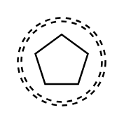

# Multiple Intermediate, Boundary Non-Interrupting

## Definition

```
{
  _style: { 
    entity: 'points=[[0.145,0.145,0],[0.5,0,0],[0.855,0.145,0],[1,0.5,0],[0.855,0.855,0],[0.5,1,0],[0.145,0.855,0],[0,0.5,0]];shape=mxgraph.bpmn.event;html=1;verticalLabelPosition=bottom;labelBackgroundColor=#ffffff;verticalAlign=top;align=center;perimeter=ellipsePerimeter;outlineConnect=0;aspect=fixed;outline=boundNonint;symbol=multiple;',
  },
  _original_width: 50,
  _original_height: 50,
}
```

## Usage

```
import { MultipleIntermediateBoundaryNonInterrupting } from '@dinghy/standard-components-diagrams/bpmn2Events'

<MultipleIntermediateBoundaryNonInterrupting/>
```

## Preview


