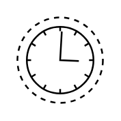

# Timer Start, Non-Interrupting

## Definition

```
{
  _style: 'points=[[0.145,0.145,0],[0.5,0,0],[0.855,0.145,0],[1,0.5,0],[0.855,0.855,0],[0.5,1,0],[0.145,0.855,0],[0,0.5,0]];shape=mxgraph.bpmn.event;html=1;verticalLabelPosition=bottom;labelBackgroundColor=#ffffff;verticalAlign=top;align=center;perimeter=ellipsePerimeter;outlineConnect=0;aspect=fixed;outline=eventNonint;symbol=timer;',
  _width: 50,
  _height: 50,
}
```

## Usage

```
import { TimerStartNonInterrupting } from '@reactiac/standard-components-diagrams/bpmn2Events'

<TimerStartNonInterrupting/>
```

## Preview


