# BPMN 2.0 Gateways Entities

- [CancelBoundaryInterrupting](./cancel-boundary-interrupting.md)  

- [CancelEnd](./cancel-end.md)  

- [CompensationInterrupting](./compensation-interrupting.md)  

- [CompensationThrowing](./compensation-throwing.md)  

- [CompensationBoundaryInterrupting](./compensation-boundary-interrupting.md)  

- [CompensationEnd](./compensation-end.md)  

- [Complex](./complex.md)  

- [Conditional](./conditional.md)  

- [ConditionalCatching](./conditional-catching.md)  

- [ConditionalInterrupting](./conditional-interrupting.md)  

- [ConditionalNonInterrupting](./conditional-non-interrupting.md)  
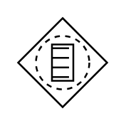

- [ConditionalBoundaryInterrupting](./conditional-boundary-interrupting.md)  

- [ConditionalBoundaryNonInterrupting](./conditional-boundary-non-interrupting.md)  
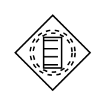

- [ErrorEnd](./error-end.md)  

- [ErrorInterrupting](./error-interrupting.md)  

- [ErrorBoundaryInterrupting](./error-boundary-interrupting.md)  

- [EscalationInterrupting](./escalation-interrupting.md)  

- [EscalationNonInterrupting](./escalation-non-interrupting.md)  
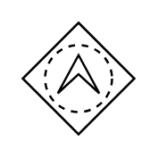

- [EscalationThrowing](./escalation-throwing.md)  

- [EscalationBoundaryInterrupting](./escalation-boundary-interrupting.md)  

- [EscalationBoundaryNonInterrupting](./escalation-boundary-non-interrupting.md)  

- [EscalationEnd](./escalation-end.md)  

- [Exclusive](./exclusive.md)  
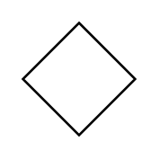

- [Exclusive2](./exclusive-2.md)  

- [Inclusive](./inclusive.md)  

- [Intermediate](./intermediate.md)  
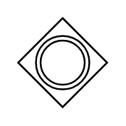

- [LinkCatching](./link-catching.md)  
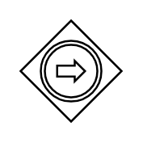

- [LinkThrowing](./link-throwing.md)  
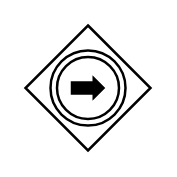

- [Message](./message.md)  

- [MessageCatching](./message-catching.md)  

- [MessageInterrupting](./message-interrupting.md)  

- [MessageNonInterrupting](./message-non-interrupting.md)  

- [MessageThrowing](./message-throwing.md)  

- [MessageBoundaryInterrupting](./message-boundary-interrupting.md)  

- [MessageBoundaryNonInterrupting](./message-boundary-non-interrupting.md)  

- [MessageEnd](./message-end.md)  

- [Multiple](./multiple.md)  
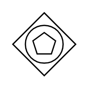

- [MultipleCatching](./multiple-catching.md)  
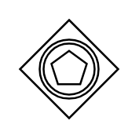

- [MultipleInterrupting](./multiple-interrupting.md)  

- [MultipleNonInterrupting](./multiple-non-interrupting.md)  
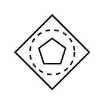

- [MultipleThrowing](./multiple-throwing.md)  
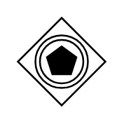

- [MultipleBoundaryInterrupting](./multiple-boundary-interrupting.md)  

- [MultipleBoundaryNonInterrupting](./multiple-boundary-non-interrupting.md)  
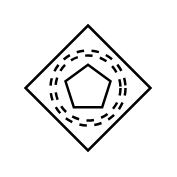

- [MultipleEnd](./multiple-end.md)  

- [MultipleStart](./multiple-start.md)  

- [Parallel](./parallel.md)  

- [ParallelMultiple](./parallel-multiple.md)  

- [ParallelMultipleCatching](./parallel-multiple-catching.md)  

- [ParallelMultipleInterrupting](./parallel-multiple-interrupting.md)  

- [ParallelMultipleNonInterrupting](./parallel-multiple-non-interrupting.md)  
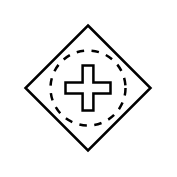

- [ParallelMultipleBoundaryInterrupting](./parallel-multiple-boundary-interrupting.md)  

- [ParallelMultipleBoundaryNonInterrupting](./parallel-multiple-boundary-non-interrupting.md)  

- [Signal](./signal.md)  
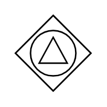

- [SignalCatching](./signal-catching.md)  

- [SignalInterrupting](./signal-interrupting.md)  

- [SignalNonInterrupting](./signal-non-interrupting.md)  
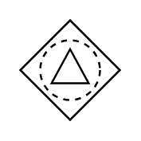

- [SignalThrowing](./signal-throwing.md)  
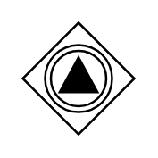

- [SignalBoundaryInterrupting](./signal-boundary-interrupting.md)  
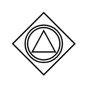

- [SignalBoundaryNonInterrupting](./signal-boundary-non-interrupting.md)  
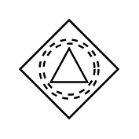

- [SignalEnd](./signal-end.md)  

- [Start](./start.md)  
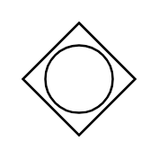

- [Terminate](./terminate.md)  

- [Timer](./timer.md)  
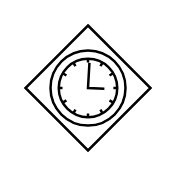

- [TimerCatching](./timer-catching.md)  
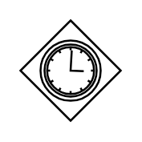

- [TimerInterrupting](./timer-interrupting.md)  

- [TimerNonInterrupting](./timer-non-interrupting.md)  

- [TimerBoundaryInterrupting](./timer-boundary-interrupting.md)  

- [TimerBoundaryNonInterrupting](./timer-boundary-non-interrupting.md)  
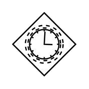
