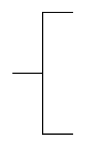

# Annotation

## Definition

```
{
  _style: 'html=1;shape=mxgraph.flowchart.annotation_2;align=left;labelPosition=right;',
  _width: 50,
  _height: 100,
}
```

## Usage

```
import { Annotation } from '@diac/standard-components-diagrams/bpmn2General'

<Annotation/>
```

## Preview


