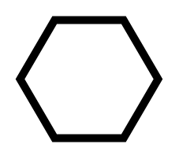

# Call Conversation

## Definition

```
{
  _style: { 
    entity: 'shape=mxgraph.bpmn.conversation2;perimeter=hexagonPerimeter2;whiteSpace=wrap;html=1;aspect=fixed;bpmnConversationType=call;',
  },
  _original_width: 70,
  _original_height: 60,
}
```

## Usage

```
import { CallConversation } from '@diac/standard-components-diagrams/bpmn2General'

<CallConversation/>
```

## Preview


