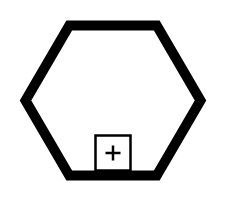

# Call Sub-Conversation

## Definition

```
{
  _style: 'shape=mxgraph.bpmn.conversation2;perimeter=hexagonPerimeter2;whiteSpace=wrap;html=1;aspect=fixed;bpmnConversationType=call;isLoopSub=1;',
  _width: 70,
  _height: 60,
}
```

## Usage

```
import { CallSubConversation } from '@reactiac/standard-components-diagrams/bpmn2General'

<CallSubConversation/>
```

## Preview


