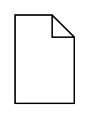

# Data Object

## Definition

```
{
  _style: 'shape=mxgraph.bpmn.data2;labelPosition=center;verticalLabelPosition=bottom;align=center;verticalAlign=top;size=15;html=1;',
  _width: 40,
  _height: 60,
}
```

## Usage

```
import { DataObject } from '@diac/standard-components-diagrams/bpmn2General'

<DataObject/>
```

## Preview


