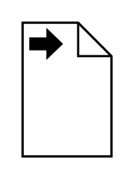

# Data Output

## Definition

```
{
  _style: { 
    entity: 'shape=mxgraph.bpmn.data2;labelPosition=center;verticalLabelPosition=bottom;align=center;verticalAlign=top;size=15;html=1;bpmnTransferType=output;',
  },
  _original_width: 40,
  _original_height: 60,
}
```

## Usage

```
import { DataOutput } from '@diac/standard-components-diagrams/bpmn2General'

<DataOutput/>
```

## Preview


