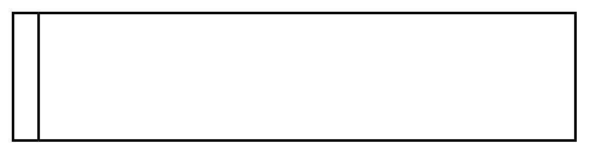

# Horizontal Lane 2

## Definition

```
{
  _style: 'swimlane;html=1;startSize=20;fontStyle=0;collapsible=0;horizontal=0;swimlaneLine=1;swimlaneFillColor=#ffffff;strokeWidth=2;whiteSpace=wrap;',
  _width: 440,
  _height: 100,
}
```

## Usage

```
import { HorizontalLane2 } from '@reactiac/standard-components-diagrams/bpmn2General'

<HorizontalLane2/>
```

## Preview


