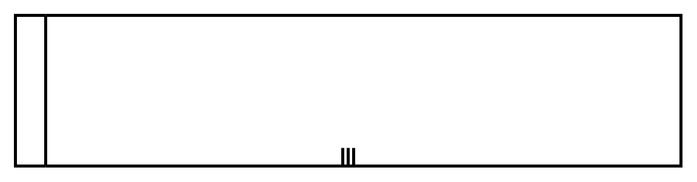

# Horizontal Lane 3

## Definition

```
{
  _style: { 
    entity: 'shape=mxgraph.bpmn.swimlane;html=1;startSize=20;horizontal=0;swimlaneLine=1;collapsible=0;fontStyle=0;swimlaneFillColor=#ffffff;strokeWidth=2;isCollection=1;whiteSpace=wrap;',
  },
  _width: 440,
  _height: 100,
}
```

## Usage

```
import { HorizontalLane3 } from '@diac/standard-components-diagrams/bpmn2General'

<HorizontalLane3/>
```

## Preview


