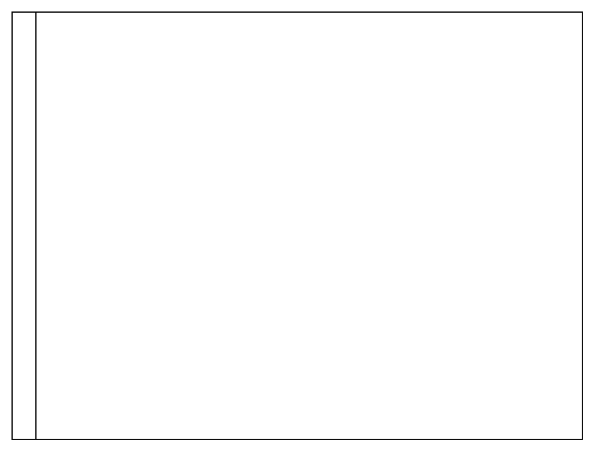

# Horizontal Pool 2

## Definition

```
{
  _style: { 
    entity: 'swimlane;html=1;childLayout=stackLayout;resizeParent=1;resizeParentMax=0;horizontal=0;startSize=20;horizontalStack=0;whiteSpace=wrap;',
  },
  _original_width: 480,
  _original_height: 360,
}
```

## Usage

```
import { HorizontalPool2 } from '@dinghy/standard-components-diagrams/bpmn2General'

<HorizontalPool2/>
```

## Preview


