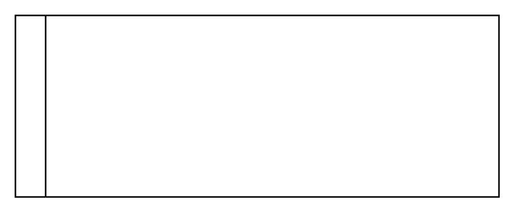

# Horizontal Swimlane

## Definition

```
{
  _style: 'swimlane;startSize=20;horizontal=0;html=1;whiteSpace=wrap;',
  _width: 320,
  _height: 120,
}
```

## Usage

```
import { HorizontalSwimlane } from '@diac/standard-components-diagrams/bpmn2General'

<HorizontalSwimlane/>
```

## Preview


