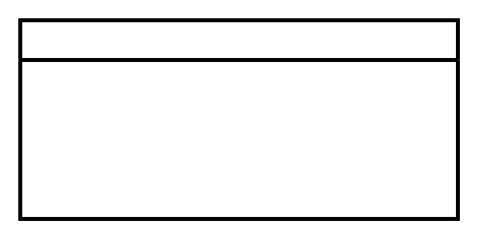

# Vertical Lane 2

## Definition

```
{
  _style: 'swimlane;html=1;startSize=20;fontStyle=0;collapsible=0;horizontal=1;swimlaneLine=1;strokeWidth=2;swimlaneFillColor=#ffffff;whiteSpace=wrap;',
  _width: 220,
  _height: 100,
}
```

## Usage

```
import { VerticalLane2 } from '@reactiac/standard-components-diagrams/bpmn2General'

<VerticalLane2/>
```

## Preview


