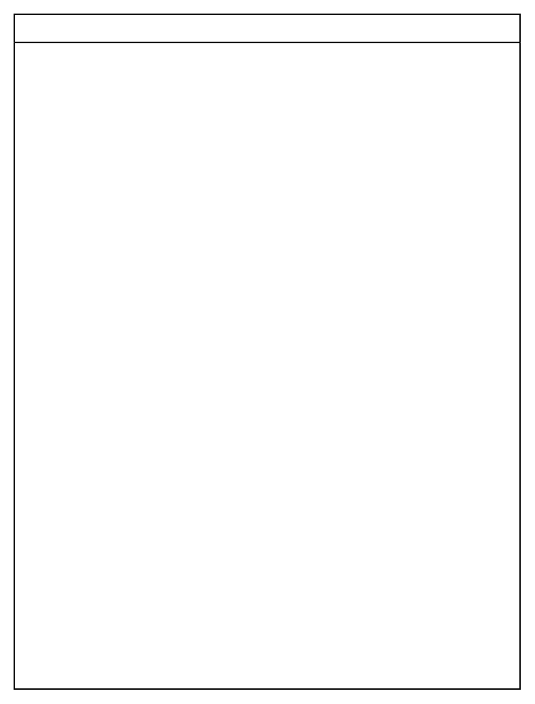

# Vertical Pool 1

## Definition

```
{
  _style: 'swimlane;html=1;childLayout=stackLayout;resizeParent=1;resizeParentMax=0;startSize=20;whiteSpace=wrap;',
  _width: 360,
  _height: 480,
}
```

## Usage

```
import { VerticalPool1 } from '@diac/standard-components-diagrams/bpmn2General'

<VerticalPool1/>
```

## Preview


