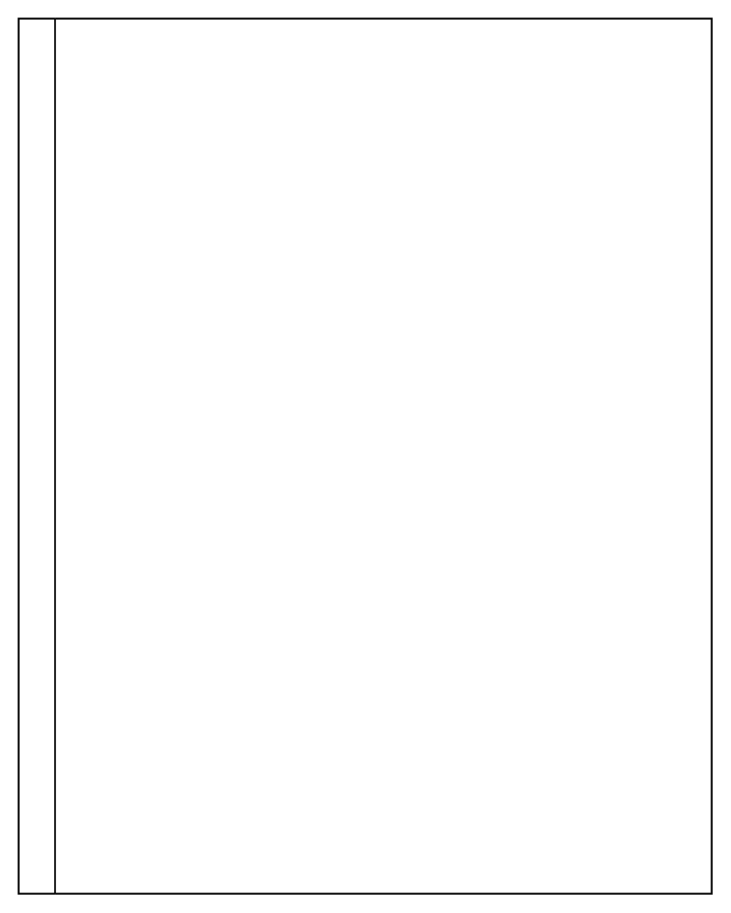

# Vertical Pool 2

## Definition

```
{
  _style: 'swimlane;html=1;childLayout=stackLayout;resizeParent=1;resizeParentMax=0;startSize=20;horizontal=0;horizontalStack=1;whiteSpace=wrap;',
  _width: 380,
  _height: 480,
}
```

## Usage

```
import { VerticalPool2 } from '@reactiac/standard-components-diagrams/bpmn2General'

<VerticalPool2/>
```

## Preview


