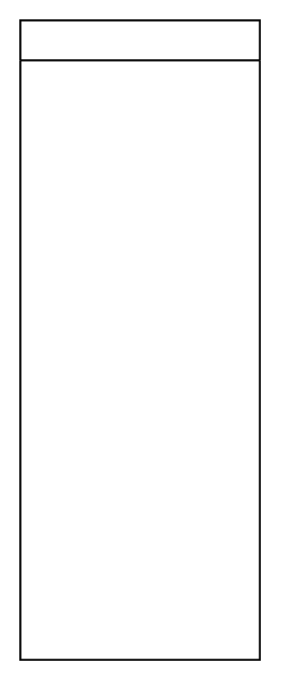

# Vertical Swimlane

## Definition

```
{
  _style: { 
    entity: 'swimlane;startSize=20;whiteSpace=wrap;html=1;',
  },
  _original_width: 120,
  _original_height: 320,
}
```

## Usage

```
import { VerticalSwimlane } from '@dinghy/standard-components-diagrams/bpmn2General'

<VerticalSwimlane/>
```

## Preview


