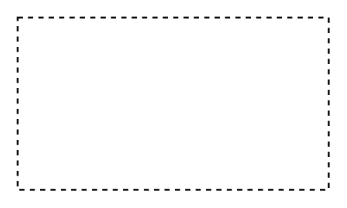

# Event Sub-Process, Expanded

## Definition

```
{
  _style: { 
    entity: 'points=[[0.25,0,0],[0.5,0,0],[0.75,0,0],[1,0.25,0],[1,0.5,0],[1,0.75,0],[0.75,1,0],[0.5,1,0],[0.25,1,0],[0,0.75,0],[0,0.5,0],[0,0.25,0]];shape=mxgraph.bpmn.task2;arcSize=10;taskMarker=abstract;outline=none;symbol=general;bpmnShapeType=subprocess;isLoopSub=0;verticalAlign=top;align=left;spacingLeft=5;html=1;whiteSpace=wrap;',
  },
  _original_width: 180,
  _original_height: 100,
}
```

## Usage

```
import { EventSubProcessExpanded } from '@dinghy/standard-components-diagrams/bpmn2Tasks'

<EventSubProcessExpanded/>
```

## Preview


