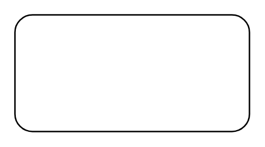

# Action

## Definition

```
{
  _style: { 
    entity: 'shape=rect;html=1;rounded=1;whiteSpace=wrap;align=center;',
  },
  _original_width: 160,
  _original_height: 80,
}
```

## Usage

```
import { Action } from '@dinghy/standard-components-diagrams/sysmlActivities'

<Action/>
```

## Preview


