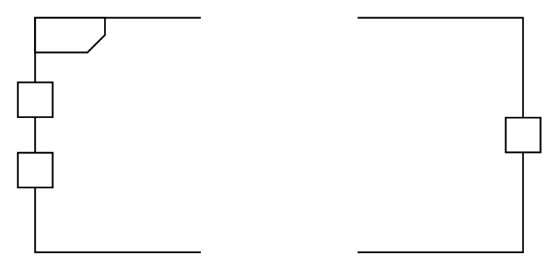

# Activity Parameter Node

## Definition

```
{
  _style: { 
    entity: 'html=1;shape=mxgraph.sysml.actParamNode;align=left;spacingLeft=15;verticalAlign=top;spacingTop=-3;',
  },
  _width: 300,
  _height: 135,
}
```

## Usage

```
import { ActivityParameterNode } from '@diac/standard-components-diagrams/sysmlActivities'

<ActivityParameterNode/>
```

## Preview


