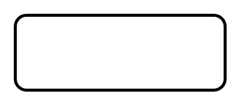

# Activity Partition 2

## Definition

```
{
  _style: { 
    entity: 'shape=rect;html=1;rounded=1;strokeWidth=2;verticalAlign=top;whiteSpace=wrap;align=center;',
  },
  _width: 140,
  _height: 50,
}
```

## Usage

```
import { ActivityPartition2 } from '@diac/standard-components-diagrams/sysmlActivities'

<ActivityPartition2/>
```

## Preview


