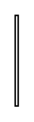

# Control Flow 2

## Definition

```
{
  _style: { 
    entity: 'edgeStyle=elbowEdgeStyle;html=1;elbow=horizontal;endArrow=open;labelBackgroundColor=none;endSize=12;',
  },
  _original_width: 2,
  _original_height: 60,
}
```

## Usage

```
import { ControlFlow2 } from '@dinghy/standard-components-diagrams/sysmlActivities'

<ControlFlow2/>
```

## Preview


