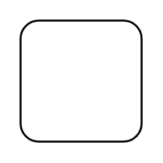

# Control Flow

## Definition

```
{
  _style: { 
    entity: 'shape=rect;html=1;rounded=1;whiteSpace=wrap;',
  },
  _original_width: 0,
  _original_height: 60,
}
```

## Usage

```
import { ControlFlow } from '@diac/standard-components-diagrams/sysmlActivities'

<ControlFlow/>
```

## Preview


