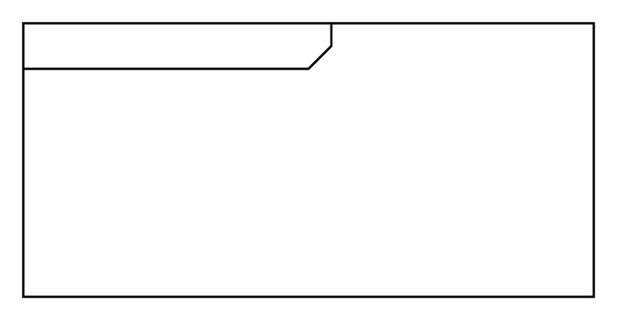

# Control Operator 2

## Definition

```
{
  _style: { 
    entity: 'html=1;shape=mxgraph.sysml.package;align=left;spacingLeft=5;verticalAlign=top;spacingTop=-3;labelX=135;html=1;overflow=fill;',
  },
  _original_width: 250,
  _original_height: 120,
}
```

## Usage

```
import { ControlOperator2 } from '@diac/standard-components-diagrams/sysmlActivities'

<ControlOperator2/>
```

## Preview


