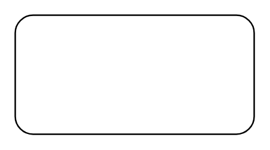

# Control Operator

## Definition

```
{
  _style: { 
    entity: 'shape=rect;rounded=1;html=1;whiteSpace=wrap;align=center;',
  },
  _width: 160,
  _height: 80,
}
```

## Usage

```
import { ControlOperator } from '@diac/standard-components-diagrams/sysmlActivities'

<ControlOperator/>
```

## Preview


