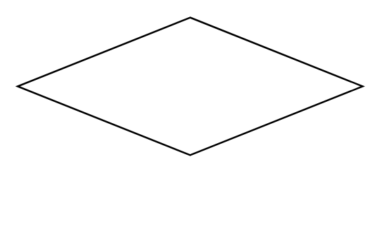

# Decision Node

## Definition

```
{
  _style: 'shape=rhombus;html=1;verticalLabelPosition=bottom;verticalAlignment=top;',
  _width: 200,
  _height: 80,
}
```

## Usage

```
import { DecisionNode } from '@reactiac/standard-components-diagrams/sysmlActivities'

<DecisionNode/>
```

## Preview


