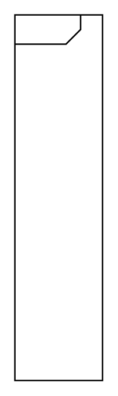

# In Block Definition Diagrams, Activity, Association

## Definition

```
{
  _style: { 
    entity: 'html=1;shape=mxgraph.sysml.package;labelX=45;align=left;spacingLeft=5;verticalAlign=top;spacingTop=-3;fontStyle=1;strokeWidth=1;recursiveResize=0;',
  },
  _original_width: 0,
  _original_height: 250,
}
```

## Usage

```
import { InBlockDefinitionDiagramsActivityAssociation } from '@diac/standard-components-diagrams/sysmlActivities'

<InBlockDefinitionDiagramsActivityAssociation/>
```

## Preview


