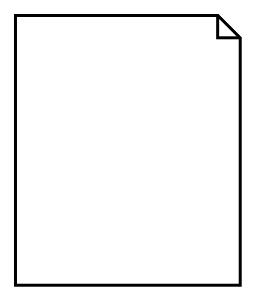

# Local Pre- and Postconditions

## Definition

```
{
  _style: 'shape=note;html=1;size=15;strokeWidth=2;align=left;spacingLeft=5;whiteSpace=wrap;align=center;',
  _width: 150,
  _height: 180,
}
```

## Usage

```
import { LocalPreAndPostconditions } from '@reactiac/standard-components-diagrams/sysmlActivities'

<LocalPreAndPostconditions/>
```

## Preview


