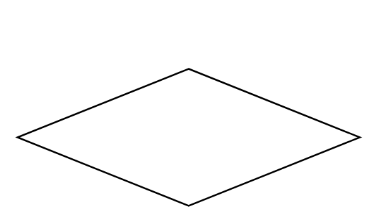

# Merge Node

## Definition

```
{
  _style: { 
    entity: 'shape=rhombus;html=1;verticalLabelPosition=top;verticalAlignment=bottom;',
  },
  _original_width: 200,
  _original_height: 80,
}
```

## Usage

```
import { MergeNode } from '@dinghy/standard-components-diagrams/sysmlActivities'

<MergeNode/>
```

## Preview


