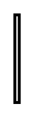

# Object Flow 3

## Definition

```
{
  _style: 'edgeStyle=elbowEdgeStyle;html=1;elbow=horizontal;endArrow=open;labelBackgroundColor=none;strokeWidth=2;endSize=12;',
  _width: 3,
  _height: 60,
}
```

## Usage

```
import { ObjectFlow3 } from '@reactiac/standard-components-diagrams/sysmlActivities'

<ObjectFlow3/>
```

## Preview


