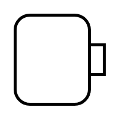

# Object Flow 4

## Definition

```
{
  _style: 'html=1;shape=mxgraph.sysml.objFlowR;strokeWidth=2;whiteSpace=wrap;',
  _width: 0,
  _height: 60,
}
```

## Usage

```
import { ObjectFlow4 } from '@reactiac/standard-components-diagrams/sysmlActivities'

<ObjectFlow4/>
```

## Preview


