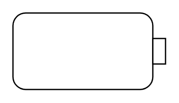

# Object Flow 6

## Definition

```
{
  _style: 'html=1;shape=mxgraph.sysml.objFlowR;whiteSpace=wrap;',
  _width: 120,
  _height: 60,
}
```

## Usage

```
import { ObjectFlow6 } from '@diac/standard-components-diagrams/sysmlActivities'

<ObjectFlow6/>
```

## Preview


