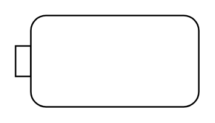

# Object Flow 7

## Definition

```
{
  _style: { 
    entity: 'html=1;shape=mxgraph.sysml.objFlowL;whiteSpace=wrap;',
  },
  _original_width: 120,
  _original_height: 60,
}
```

## Usage

```
import { ObjectFlow7 } from '@dinghy/standard-components-diagrams/sysmlActivities'

<ObjectFlow7/>
```

## Preview


