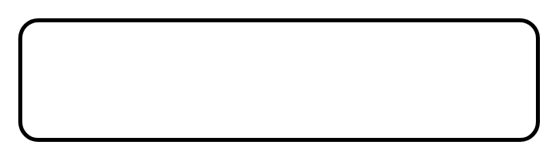

# Object Flow

## Definition

```
{
  _style: 'shape=rect;html=1;rounded=1;strokeWidth=2;whiteSpace=wrap;',
  _width: 260,
  _height: 60,
}
```

## Usage

```
import { ObjectFlow } from '@reactiac/standard-components-diagrams/sysmlActivities'

<ObjectFlow/>
```

## Preview


