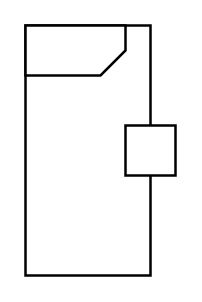

# Optional

## Definition

```
{
  _style: 'html=1;shape=mxgraph.sysml.isActStream;align=left;spacingLeft=5;verticalAlign=top;spacingTop=-3;fontStyle=1;',
  _width: 0,
  _height: 100,
}
```

## Usage

```
import { Optional } from '@reactiac/standard-components-diagrams/sysmlActivities'

<Optional/>
```

## Preview


