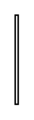

# Probability 9

## Definition

```
{
  _style: { 
    entity: 'edgeStyle=none;html=1;align=center;verticalAlign=top;endArrow=open;endSize=12;exitX=1;exitY=0.7;fillColor=#ffffff;labelBackgroundColor=none;rounded=0;',
  },
  _original_width: 2,
  _original_height: 60,
}
```

## Usage

```
import { Probability9 } from '@diac/standard-components-diagrams/sysmlActivities'

<Probability9/>
```

## Preview


