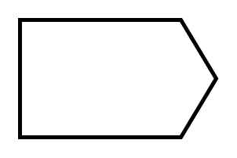

# Send Signal Action

## Definition

```
{
  _style: { 
    entity: 'html=1;shape=mxgraph.sysml.sendSigAct;strokeWidth=2;whiteSpace=wrap;align=center;',
  },
  _original_width: 100,
  _original_height: 60,
}
```

## Usage

```
import { SendSignalAction } from '@diac/standard-components-diagrams/sysmlActivities'

<SendSignalAction/>
```

## Preview


