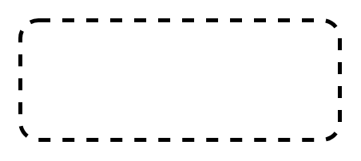

# Structured Activity Node

## Definition

```
{
  _style: { 
    entity: 'shape=rect;html=1;rounded=1;dashed=1;strokeWidth=2;verticalAlign=top;whiteSpace=wrap;align=center;',
  },
  _original_width: 160,
  _original_height: 60,
}
```

## Usage

```
import { StructuredActivityNode } from '@dinghy/standard-components-diagrams/sysmlActivities'

<StructuredActivityNode/>
```

## Preview


