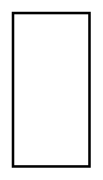

# Allocation derived properties (Block)

## Definition

```
{
  _style: 'fontStyle=1;align=center;verticalAlign=middle;childLayout=stackLayout;horizontal=1;horizontalStack=0;resizeParent=1;resizeParentMax=0;resizeLast=0;marginBottom=0;strokeWidth=2;',
  _width: 0,
  _height: 120,
}
```

## Usage

```
import { AllocationDerivedPropertiesBlock } from '@reactiac/standard-components-diagrams/sysmlAllocations'

<AllocationDerivedPropertiesBlock/>
```

## Preview


