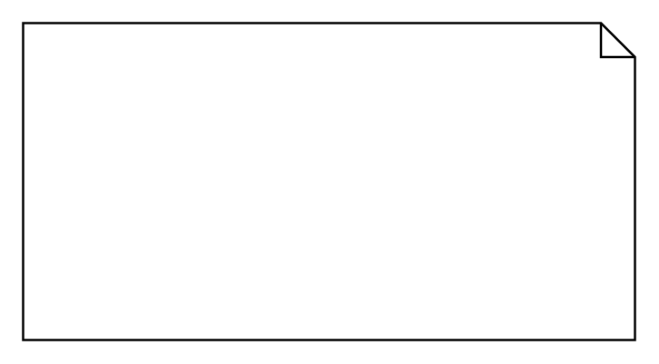

# Allocation derived properties (Comment)

## Definition

```
{
  _style: 'shape=note;html=1;size=15;spacingLeft=5;align=left;html=1;overflow=fill;whiteSpace=wrap;align=center;',
  _width: 270,
  _height: 140,
}
```

## Usage

```
import { AllocationDerivedPropertiesComment } from '@diac/standard-components-diagrams/sysmlAllocations'

<AllocationDerivedPropertiesComment/>
```

## Preview


