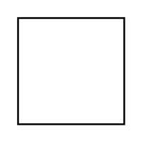
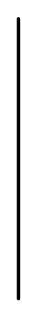
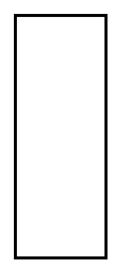

# Sysml Allocations Entities

- [AllocatedStereotype](./allocated-stereotype.md)  

- [AllocationGeneral](./allocation-general.md)  

- [AllocationGeneral2](./allocation-general-2.md)  

- [AllocationActivityPartition](./allocation-activity-partition.md)  

- [AllocationActivityPartition2](./allocation-activity-partition-2.md)  

- [AllocationDerivedPropertiesActivityDiagram](./allocation-derived-properties-activity-diagram.md)  

- [AllocationDerivedPropertiesBlock](./allocation-derived-properties-block.md)  

- [AllocationDerivedPropertiesComment](./allocation-derived-properties-comment.md)  

- [AllocationDerivedPropertiesComment2](./allocation-derived-properties-comment-2.md)  

- [AllocationDerivedPropertiesComment3](./allocation-derived-properties-comment-3.md)  

- [AllocationDerivedPropertiesInternalBlockDiagram](./allocation-derived-properties-internal-block-diagram.md)  

