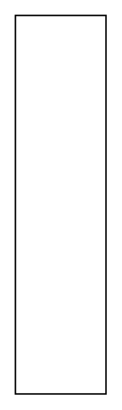

# Connector Property

## Definition

```
{
  _style: { 
    entity: 'shape=rect;html=1;overflow=fill;whiteSpace=wrap;	recursiveResize=0;',
  },
  _width: 0,
  _height: 250,
}
```

## Usage

```
import { ConnectorProperty } from '@diac/standard-components-diagrams/sysmlBlocks'

<ConnectorProperty/>
```

## Preview


