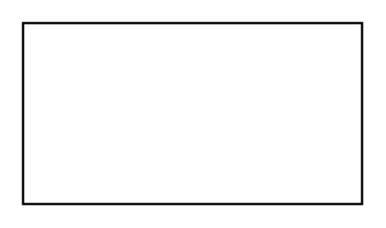

# Generalization Set 2

## Definition

```
{
  _style: 'edgeStyle=none;html=1;endArrow=block;endFill=0;endSize=12;',
  _width: 150,
  _height: 80,
}
```

## Usage

```
import { GeneralizationSet2 } from '@diac/standard-components-diagrams/sysmlBlocks'

<GeneralizationSet2/>
```

## Preview


