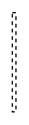

# Generalization Set 3

## Definition

```
{
  _style: { 
    entity: 'edgeStyle=none;html=1;endArrow=none;dashed=1;labelPosition=right;align=left;',
  },
  _width: 3,
  _height: 80,
}
```

## Usage

```
import { GeneralizationSet3 } from '@diac/standard-components-diagrams/sysmlBlocks'

<GeneralizationSet3/>
```

## Preview


