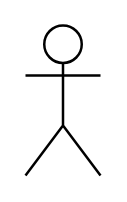
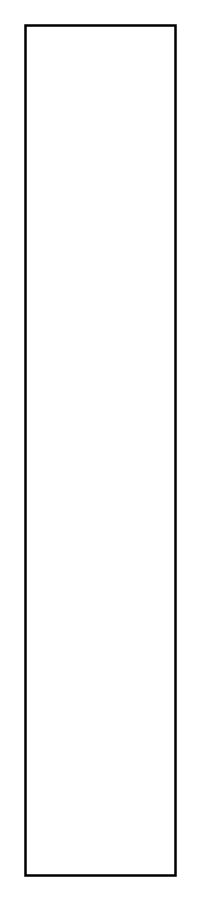
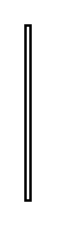
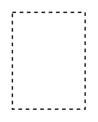

# Sysml Blocks Entities

- [Actor](./actor.md)  

- [Actor2](./actor-2.md)  

- [Block](./block.md)  

- [BlockDefinitionDiagram](./block-definition-diagram.md)  

- [BlockNamespaceContainment](./block-namespace-containment.md)  

- [BlockNamespaceContainment2](./block-namespace-containment-2.md)  

- [ConnectorProperty](./connector-property.md)  

- [GeneralizationSet](./generalization-set.md)  

- [GeneralizationSet2](./generalization-set-2.md)  

- [GeneralizationSet3](./generalization-set-3.md)  

- [InstanceSpecification](./instance-specification.md)  

- [InstanceSpecification2](./instance-specification-2.md)  

- [InstanceSpecification3](./instance-specification-3.md)  

- [InternalBlockDiagram](./internal-block-diagram.md)  

- [MultibranchGeneralization](./multibranch-generalization.md)  

- [MultibranchGeneralization2](./multibranch-generalization-2.md)  

- [MultibranchPartAssociation](./multibranch-part-association.md)  

- [MultibranchPartAssociation2](./multibranch-part-association-2.md)  

- [MultibranchPartAssociation3](./multibranch-part-association-3.md)  

- [MultibranchPartAssociation4](./multibranch-part-association-4.md)  

- [MultibranchSharedAssociation](./multibranch-shared-association.md)  

- [MultibranchSharedAssociation2](./multibranch-shared-association-2.md)  

- [MultibranchSharedAssociation3](./multibranch-shared-association-3.md)  

- [MultibranchSharedAssociation4](./multibranch-shared-association-4.md)  

- [NamespaceCompartment](./namespace-compartment.md)  

- [Package](./package.md)  

- [PartAssociation](./part-association.md)  

- [PartAssociation2](./part-association-2.md)  

- [Participant](./participant.md)  

- [ParticipantProperty](./participant-property.md)  

- [ParticipantProperty2](./participant-property-2.md)  

- [ParticipantProperty3](./participant-property-3.md)  

- [ParticipantProperty4](./participant-property-4.md)  

- [ParticipantProperty5](./participant-property-5.md)  

- [ParticipantProperty6](./participant-property-6.md)  

- [Property](./property.md)  

- [Property2](./property-2.md)  

- [ReferenceAssociation](./reference-association.md)  

- [Relation](./relation.md)  

- [Relation2](./relation-2.md)  

- [SharedAssociation](./shared-association.md)  

- [SharedAssociation2](./shared-association-2.md)  

- [Unit](./unit.md)  

