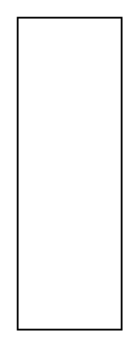

# Instance Specification 3

## Definition

```
{
  _style: { 
    entity: 'shape=rect;html=1;overflow=fill;whiteSpace=wrap;recursiveResize=0;',
  },
  _width: 0,
  _height: 180,
}
```

## Usage

```
import { InstanceSpecification3 } from '@diac/standard-components-diagrams/sysmlBlocks'

<InstanceSpecification3/>
```

## Preview


