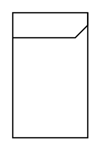

# Internal Block Diagram

## Definition

```
{
  _style: { 
    entity: 'html=1;shape=mxgraph.sysml.package;labelX=100;align=left;spacingLeft=10;html=1;overflow=fill;whiteSpace=wrap;recursiveResize=0;',
  },
  _original_width: 0,
  _original_height: 100,
}
```

## Usage

```
import { InternalBlockDiagram } from '@dinghy/standard-components-diagrams/sysmlBlocks'

<InternalBlockDiagram/>
```

## Preview


