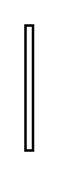

# Multibranch Shared Association 4

## Definition

```
{
  _style: { 
    entity: 'edgeStyle=elbowEdgeStyle;html=1;elbow=vertical;align=left;verticalAlign=bottom;endArrow=diamondThin;rounded=0;endFill=0;endSize=12;labelBackgroundColor=none;',
  },
  _width: 3,
  _height: 50,
}
```

## Usage

```
import { MultibranchSharedAssociation4 } from '@diac/standard-components-diagrams/sysmlBlocks'

<MultibranchSharedAssociation4/>
```

## Preview


