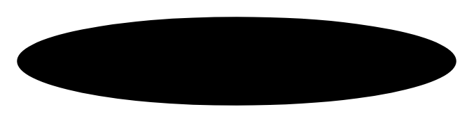

# Multibranch Shared Association

## Definition

```
{
  _style: { 
    entity: 'verticalAlign=bottom;html=1;ellipse;fillColor=strokeColor;',
  },
  _original_width: 250,
  _original_height: 50,
}
```

## Usage

```
import { MultibranchSharedAssociation } from '@dinghy/standard-components-diagrams/sysmlBlocks'

<MultibranchSharedAssociation/>
```

## Preview


