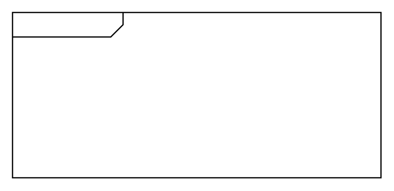

# Package

## Definition

```
{
  _style: { 
    entity: 'html=1;shape=mxgraph.sysml.package;html=1;overflow=fill;whiteSpace=wrap;',
  },
  _original_width: 300,
  _original_height: 135,
}
```

## Usage

```
import { Package } from '@diac/standard-components-diagrams/sysmlBlocks'

<Package/>
```

## Preview


